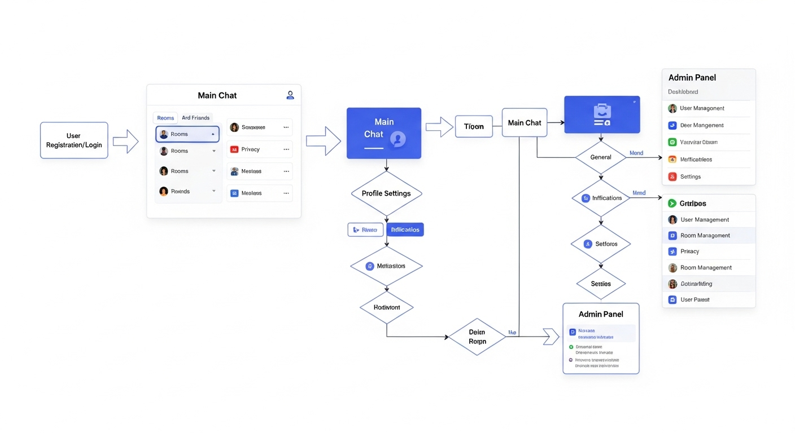
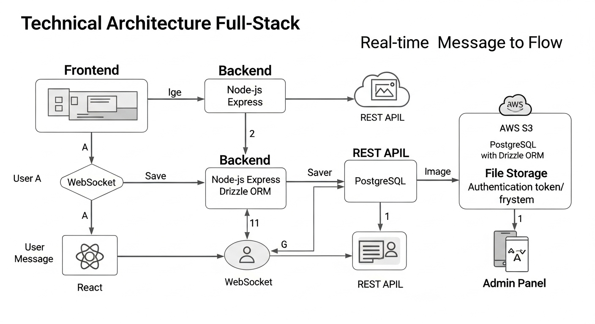
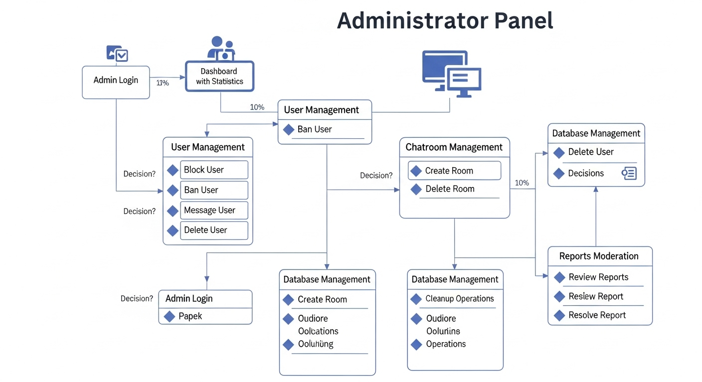
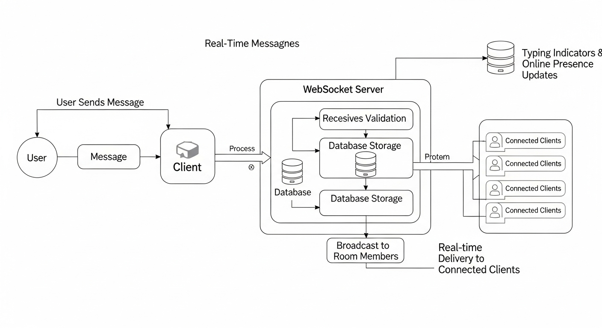

# Chatual - System Flowcharts & Architecture Diagrams

This document contains visual flowcharts and diagrams that illustrate the various systems, processes, and user flows within the Chatual application.

---

## 1. Main User Flow Diagram

**This flowchart illustrates the primary user journey through the application:**

### User Registration & Authentication Flow:
1. **Landing Page** → User chooses to register or login
2. **Registration Form** → User provides username, password, age, gender, location
3. **Login Form** → Existing users authenticate with credentials
4. **Authentication Success** → User redirected to main chat interface

### Main Chat Interface Flow:
5. **Chat Dashboard** → Central hub with sidebar navigation
6. **Room Selection** → User can join public rooms or create private rooms
7. **Friend Management** → Access friends list, send requests, start private chats
8. **Message Interface** → Send messages, photos, mentions with real-time delivery

### Profile Management Flow:
9. **Profile Settings** → Comprehensive settings with multiple tabs
10. **Photo Management** → Upload and manage profile photos
11. **Privacy Controls** → Block users, set visibility preferences
12. **Account Management** → Delete account, export data (GDPR)

### Admin Access Flow:
13. **Admin Login** → Separate authentication for administrators
14. **Admin Dashboard** → Access to system statistics and management tools

---

## 2. Technical Architecture Diagram

**This diagram shows the complete technical stack and data flow:**

### Frontend Layer:
- **React 18** with TypeScript for user interface
- **Vite** for fast development and build process
- **TanStack Query** for server state management
- **shadcn/ui** components for consistent design
- **WebSocket Client** for real-time communication

### Backend Layer:
- **Node.js + Express** server handling HTTP requests
- **WebSocket Server** for real-time message broadcasting
- **Authentication Middleware** for session management
- **API Routes** for CRUD operations and admin functions

### Database Layer:
- **PostgreSQL** primary database for all persistent data
- **Drizzle ORM** for type-safe database operations
- **Session Store** for user authentication persistence
- **Message Storage** with automatic cleanup policies

### External Services:
- **AWS S3** for photo and file storage
- **Geocoding APIs** for location-based features
- **Email Services** for notifications (future enhancement)

### Data Flow:
1. Client requests → Express API → Database operations
2. Real-time messages → WebSocket → Broadcast to room members
3. File uploads → S3 storage → Database metadata
4. Admin operations → Protected routes → Database updates

---

## 3. Admin Panel Workflow

**This flowchart details the administrative workflow and decision processes:**

### Admin Authentication:
1. **Admin Login** → Separate credential verification
2. **Session Validation** → Check admin privileges
3. **Dashboard Access** → Main administrative interface

### User Management Workflow:
4. **User Search** → Find specific users by filters
5. **Action Selection** → Choose from block, ban, message, or delete
6. **Block User** → Temporary or permanent blocking with reasons
7. **Ban User** → Account suspension with audit logging
8. **Send Message** → Direct communication to users
9. **Delete Account** → Permanent user removal with confirmation

### Content Moderation:
10. **View Reports** → Review user-submitted reports
11. **Investigation** → Examine reported content and behavior
12. **Resolution** → Approve, dismiss, or escalate reports
13. **Action Logging** → Record all moderation decisions

### System Management:
14. **Database Statistics** → Monitor system health and usage
15. **Cleanup Operations** → Manage storage and data retention
16. **Room Management** → Create, modify, or delete chat rooms
17. **System Configuration** → Adjust application settings

### Decision Points:
- **Severity Assessment** → Determine appropriate action level
- **Evidence Review** → Validate reports and complaints
- **Policy Compliance** → Ensure actions follow community guidelines
- **Appeal Process** → Handle user disputes and appeals

---

## 4. Real-Time Messaging System

**This diagram illustrates the real-time message delivery system:**

### Message Creation Flow:
1. **User Input** → Message composed in chat interface
2. **Client Validation** → Basic checks for content and length
3. **WebSocket Send** → Message transmitted to server
4. **Server Reception** → WebSocket server receives message

### Message Processing:
5. **Authentication Check** → Verify user session and permissions
6. **Content Validation** → Check for spam, inappropriate content
7. **Database Storage** → Persist message with metadata
8. **Sequence Assignment** → Assign unique message ID and sequence

### Message Broadcasting:
9. **Room Member Lookup** → Identify connected users in room
10. **Message Formatting** → Add user details and timestamps
11. **WebSocket Broadcast** → Send to all room members simultaneously
12. **Client Reception** → Connected clients receive message instantly

### Real-Time Features:
13. **Typing Indicators** → Show when users are composing messages
14. **Online Presence** → Track and broadcast user connection status
15. **Message Delivery Status** → Confirm successful delivery
16. **Connection Recovery** → Handle reconnections and message sync

### Error Handling:
- **Connection Loss** → Queue messages locally until reconnection
- **Message Failures** → Retry delivery with exponential backoff
- **Duplicate Prevention** → Ensure messages aren't sent multiple times
- **Rate Limiting** → Prevent spam and system abuse

### Performance Optimization:
- **Room-Based Broadcasting** → Only send messages to relevant users
- **Connection Pooling** → Efficient WebSocket management
- **Message Batching** → Group multiple updates for efficiency
- **Caching Strategy** → Store recent messages for quick access

---

## System Integration Points

### Database Schema Integration:
- **Users Table** → Stores all user account information
- **Messages Table** → Chat message history with relationships
- **Rooms Table** → Chat room definitions and member lists
- **Admin Tables** → Moderation actions and system logs

### API Endpoint Structure:
- **REST APIs** → CRUD operations for persistent data
- **WebSocket Events** → Real-time communication protocol
- **Authentication Routes** → Login, logout, session management
- **Admin APIs** → Protected endpoints for administrative functions

### Security Integration:
- **Session Management** → Secure cookie-based authentication
- **CORS Protection** → Cross-origin request security
- **Input Validation** → Prevent injection and malformed data
- **Role-Based Access** → Different permissions for users vs admins

### Monitoring & Logging:
- **Performance Metrics** → Response times and system health
- **Error Tracking** → Exception logging and alerting
- **User Analytics** → Usage patterns and feature adoption
- **Security Audits** → Admin action logging and compliance

---

*These flowcharts provide a comprehensive visual guide to understanding the Chatual application's architecture, user flows, and system processes. They serve as reference documentation for development, maintenance, and future enhancements.*

**Last Updated:** September 18, 2025  
**Document Version:** 1.0.0